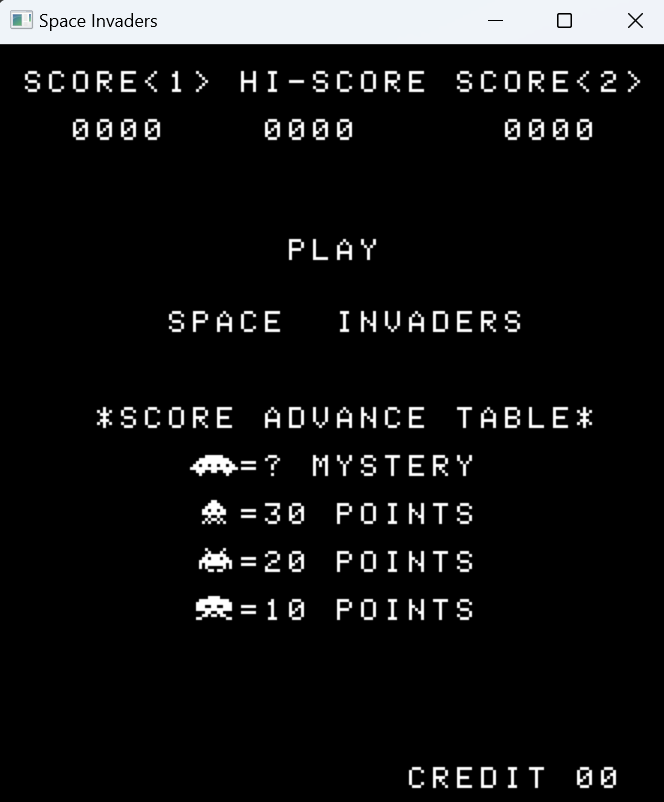

# 8080emu
Intel 8080 Space Invaders emulator written in C.

SDL2 for rendering.

## Resources
- http://www.emulator101.com/ for kickstarting and general concepts.
- https://lazyfoo.net/tutorials/SDL/ for SDL2.
- https://computerarcheology.com/Arcade/SpaceInvaders/Hardware.html for Space Invaders documentation.
- https://github.com/superzazu/invaders and https://github.com/superzazu/8080 for reference (rendering and opcodes).

